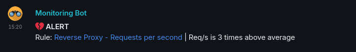

# Grafana Matrix Alerts

This project offers an easy method to forward [Grafana](https://grafana.com) alerts to a (encrypted) [Matrix](https://matrix.org) room.

Simply configure a Grafana webhook alert channel to direct alerts to this bot. The bot will then send the incoming webhook as a Matrix message to the specified chat room.

---



## 1. Features

* 🔒️ **E2EE Support**
    * Support for encrypted matrix rooms
* 📎 **Simple**
    * No config files, all required parameters provided on startup
* 🪁 **Flexible**
    * Support multiple grafana alert channels to multiple matrix rooms

## Usage

### Docker Container

We provide prebuilt docker images, and you can use the example `docker-compose.yaml`:

``` yaml
services:
  grafana-matrix-alerts:
    image: docker.io/alyx161/grafana-matrix-alerts:latest
    container_name: grafana-matrix-alerts
    restart: unless-stopped
    environment:
      GMA_HOMESERVER: "matrix.org"
      GMA_USERNAME: "grafana-bot"
      GMA_PASSWORD: "Trains?!"
      GMA_RECOVERYKEY: "TRANSRIGHTSAREHUMANRIGHTS!"
    volumes:
      - ./data:/data

```

### Grafana Config

Add a new **Contact Point** in Grafana with the **POST webhook** type. Use the following URL:
```
http://<ip address>:8080/api/v1/unified/<roomId>
```

Replace `<roomId>` with the ID of the room where you would like to receive the notifications.  
The bot tells you the room ID once you invite it to a room. Alternatively, you can look up the room ID in the room details of your Matrix client.


### Attention
The bot is designed to run locally on your Grafana server; therefore, it doesn't have any authentication mechanism. This means that, theoretically, anyone with the address can send notifications to the webhook endpoint.

Please make sure that it can only be accessed internally by your Grafana server.

## Configuration

The bot is configured through environment variables. The following configuration options are available:


| Environment Variable | Default value  | Required | Description                                                                                                                       |
|----------------------|----------------|----------|-----------------------------------------------------------------------------------------------------------------------------------|
| GMA_PORT             | 8080           | No       | Port used by the webserver, which is listening for the webhook calls                                                              |
| GMA_HOMESERVER       | N/A            | **Yes**  | Your matrix homeserver                                                                                                            |
| GMA_USERNAME         | N/A            | **Yes**  | The username used to login to your matrix server.                                                                                 |
| GMA_PASSWORD         | N/A            | **Yes**  | The matrix user password                                                                                                          |
| GMA_DATABASE         | `/data/gma.db` | No       | Path to the database                                                                                                              |
| GMA_RECOVERYKEY      | N/A            | **Yes**  | The recovery key of your matrix account. This is used so the bot can verify itself. Can be removed after successful verification. |
| GMA_DEBUGLOG         | false          | No       | Enables the debug level log output                                                                                                |


## Thanks

Thanks a lot to Hector from [grafana-matrix-forwarder](https://gitlab.com/hctrdev/grafana-matrix-forwarder), which this bot is heavily inspired by.  
This bot is made possible by the [maunium.net/go/mautrix](https://maunium.net/go/mautrix/) library.
